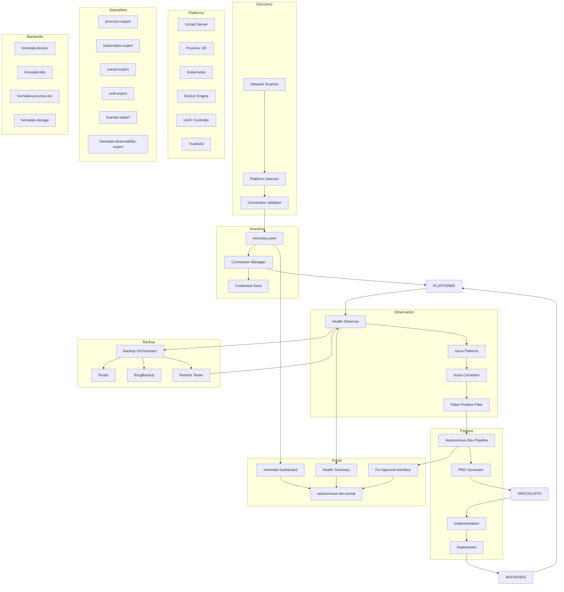

# PRD-001: Homelab Platform

| Field       | Value                                      |
|-------------|--------------------------------------------|
| **Title**   | Homelab Platform                            |
| **PRD ID**  | PRD-001                                    |
| **Version** | 1.0                                        |
| **Date**    | 2026-04-28                                 |
| **Author**  | Patrick Watson                             |
| **Status**  | Draft                                      |
| **Plugin**  | autonomous-dev-homelab (new sibling repo)  |

---

## 1. Problem Statement

Operators running homelabs juggle multiple platforms — Unraid, Docker, Proxmox VE, Kubernetes (k3s/k8s), Docker Swarm, UniFi controllers, and FreeNAS/TrueNAS — each with its own dashboard, failure modes, and remediation patterns. When something breaks (a container OOMs, a UniFi AP loses uplink, a ZFS pool degrades), the operator hunts logs across multiple interfaces, correlates symptoms manually, and implements fixes through platform-specific tools. This reactive debugging model scales poorly as homelab complexity grows.

**Current operational reality:**
- **Platform fragmentation**: Each system exposes health through different interfaces — Unraid's WebGUI, Proxmox's web console, kubectl CLI, UniFi's controller dashboard, TrueNAS's management interface. Operators context-switch between 5+ tools to understand overall infrastructure health.
- **Alert fatigue without context**: Monitoring solutions (Prometheus + Grafana, Uptime Kuma) generate alerts but lack the context to suggest fixes. An alert "docker-container-restarting" doesn't tell the operator whether to increase memory limits, fix networking, or update the image.
- **Manual remediation**: Even when the root cause is obvious ("out of memory"), the fix requires manual intervention — edit compose files, restart containers, update configurations. There's no closed-loop system that can observe problems and implement solutions.
- **Knowledge silos**: Platform-specific expertise is scattered across documentation, forum posts, and operator memory. When a ZFS pool shows checksum errors, the operator must remember the `zpool scrub` workflow or research it again.

**The autonomous opportunity**: Homelab platforms expose rich telemetry and management APIs. Most common failures follow predictable patterns with documented remediation steps. Unlike production environments with strict change control, homelabs tolerate automated fixes if they're properly gated by operator approval.

This PRD introduces the `autonomous-dev-homelab` plugin that auto-detects homelab platforms, connects to them via MCP servers or SSH+CLI fallback, observes their state continuously, generates fix proposals through autonomous-dev's pipeline, and (with operator approval) applies remediation — including non-trivial migrations like Portainer→k3s when point fixes aren't viable.

**Scope boundaries**: This plugin is not a hyperconverged infrastructure replacement or multi-tenant homelab-as-a-service. It targets single-operator homelabs where the autonomous-dev system has appropriate permissions to observe and modify infrastructure within safety guardrails.

---

## 2. Goals

| ID   | Goal                                                                                           |
|------|------------------------------------------------------------------------------------------------|
| G-01 | Auto-discover homelab platforms on the local network and provide operator-confirmed inventory management for Unraid, Proxmox VE, Docker, Kubernetes, Docker Swarm, UniFi, and TrueNAS/FreeNAS. |
| G-02 | Implement platform-agnostic observation that detects container health issues, disk failures, network problems, service outages, and resource exhaustion across heterogeneous homelab infrastructure. |
| G-03 | Generate autonomous fix proposals for common homelab failure patterns through the standard autonomous-dev pipeline (observation → PRD → TDD → implementation → deployment). |
| G-04 | Execute approved fixes through deployment backends that target homelab platforms — container restarts, configuration updates, resource scaling, DNS changes, and backup operations. |
| G-05 | Support complex migrations (e.g., Portainer→k3s, Docker Swarm→k8s) when incremental fixes are insufficient, with full approval gates and rollback capability. |
| G-06 | Integrate with autonomous-dev portal to provide homelab-specific dashboard surfaces showing infrastructure health, recent fixes, and migration opportunities. |
| G-07 | Maintain trust-based approval workflows where homelab actions default to L1 (require operator approval) with option to elevate to L2/L3 for routine operations after establishing confidence. |
| G-08 | Implement backup orchestration and restore testing for critical homelab data, with automated verification that backups are viable and accessible. |

## 3. Non-Goals

| ID    | Non-Goal                                                                                     |
|-------|----------------------------------------------------------------------------------------------|
| NG-01 | Not a hyperconverged infrastructure system. This plugin works with existing homelab platforms rather than replacing them. |
| NG-02 | Not multi-tenant. The system targets single-operator or small family/team homelabs with shared administrative access. |
| NG-03 | Not a homelab-as-a-service product. No public cloud integration or remote homelab management for third parties. |
| NG-04 | Not a monitoring system replacement. The plugin reads from existing monitoring (Prometheus, Uptime Kuma, platform-native health endpoints) rather than implementing custom telemetry collection. |
| NG-05 | Not a configuration management system. While the plugin can modify configurations to fix problems, it's not intended for general-purpose infrastructure-as-code deployment. |
| NG-06 | Not a hardware management system. The plugin works with software platforms running on homelab hardware but doesn't control power, IPMI, or physical infrastructure. |

---

## 4. User Stories

### Platform Discovery & Inventory

| ID    | Story                                                                                                                                                                                      | Priority |
|-------|--------------------------------------------------------------------------------------------------------------------------------------------------------------------------------------------|----------|
| US-01 | As a homelab operator, I want the system to scan my local network for homelab platforms and present discovered systems for confirmation before adoption, so I control what gets managed. | P0       |
| US-02 | As a homelab operator, I want the system to persist my confirmed inventory and re-check connectivity on schedule, so I know when platforms become unavailable or configuration changes. | P0       |
| US-03 | As a homelab operator, I want to manually add platforms that aren't auto-discoverable (headless servers, non-standard ports), so the system can manage my full infrastructure. | P1       |

### Health Observation

| ID    | Story                                                                                                                                                                                      | Priority |
|-------|--------------------------------------------------------------------------------------------------------------------------------------------------------------------------------------------|----------|
| US-04 | As a homelab operator, I want the system to continuously monitor container health, disk status, network connectivity, and service availability across all my platforms, so problems are detected before they cause outages. | P0       |
| US-05 | As a homelab operator, when the system detects an issue (container restarting, disk errors, AP offline), I want it to generate a structured observation with evidence and suggested remediation, so I can make informed approval decisions. | P0       |
| US-06 | As a homelab operator, I want the system to correlate related issues across platforms (e.g., network storage affecting multiple containers), so I get one coherent fix proposal rather than multiple uncoordinated alerts. | P1       |

### Automated Remediation

| ID    | Story                                                                                                                                                                                      | Priority |
|-------|--------------------------------------------------------------------------------------------------------------------------------------------------------------------------------------------|----------|
| US-07 | As a homelab operator, I want the system to propose fixes for common issues (restart failed containers, clear log files, update DNS records) and execute them after my approval, so routine maintenance happens efficiently. | P0       |
| US-08 | As a homelab operator, when a fix requires multiple steps or affects multiple platforms, I want the system to generate a complete implementation plan and execute it atomically, so partial failures don't leave my infrastructure in an inconsistent state. | P0       |
| US-09 | As a homelab operator, I want the system to have rollback capability for configuration changes, so I can safely approve fixes knowing I can undo them if something goes wrong. | P1       |

### Migration & Architecture Evolution

| ID    | Story                                                                                                                                                                                      | Priority |
|-------|--------------------------------------------------------------------------------------------------------------------------------------------------------------------------------------------|----------|
| US-10 | As a homelab operator, when the system detects chronic issues that can't be fixed incrementally (e.g., Portainer resource management problems), I want it to propose architectural migrations (e.g., to k3s) with a full implementation plan. | P1       |
| US-11 | As a homelab operator, I want migration proposals to include a detailed comparison of current vs. target architecture, migration steps, rollback plan, and expected benefits/risks, so I can make educated decisions about major changes. | P1       |
| US-12 | As a homelab operator, I want the system to execute migrations through the standard autonomous-dev pipeline with appropriate safety gates, so complex infrastructure changes get the same rigor as code changes. | P1       |

### Backup & Recovery

| ID    | Story                                                                                                                                                                                      | Priority |
|-------|--------------------------------------------------------------------------------------------------------------------------------------------------------------------------------------------|----------|
| US-13 | As a homelab operator, I want the system to orchestrate backups of critical data (databases, configuration files, volumes) across platforms and verify backup integrity through restore tests. | P1       |
| US-14 | As a homelab operator, when backup operations fail or restore tests reveal corruption, I want the system to alert me immediately and propose remediation (different backup targets, scheduling changes). | P1       |

### Dashboard Integration

| ID    | Story                                                                                                                                                                                      | Priority |
|-------|--------------------------------------------------------------------------------------------------------------------------------------------------------------------------------------------|----------|
| US-15 | As a homelab operator, I want homelab health information displayed in the autonomous-dev portal with platform-specific views, so I can see infrastructure status alongside development pipeline activity. | P1       |
| US-16 | As a homelab operator, I want to see recent automated fixes, pending approvals, and migration recommendations in a homelab-specific dashboard, so I can track the system's infrastructure management activity. | P1       |

---

## 5. Functional Requirements

### 5.1 Platform Auto-Discovery

| ID     | Requirement                                                                                                                                                                                     | Priority |
|--------|-------------------------------------------------------------------------------------------------------------------------------------------------------------------------------------------------|----------|
| FR-101 | The system SHALL scan the local network (operator's subnet) for homelab platforms using characteristic signatures: UniFi controllers (HTTPS to common IPs with UniFi-specific SSL cert patterns), Unraid servers (port 80/443 with identifying HTTP headers), Proxmox VE (port 8006 with characteristic login page), Docker engines (socket access or TCP 2375/2376), Kubernetes API servers (port 6443 with k8s API), TrueNAS/FreeNAS (ports 80/443 with identifying UI patterns). | P0       |
| FR-102 | Discovery SHALL be triggered on first run and periodically (default: daily at 2 AM) to detect new platforms or configuration changes. | P0       |
| FR-103 | The system SHALL present discovered platforms to the operator for confirmation before adding them to the managed inventory, including platform type, detected IP/hostname, and suggested connection method. | P0       |
| FR-104 | Confirmed inventory SHALL be persisted at `<homelab-data>/inventory.yaml` with platform metadata, connection details, and last-verified timestamp. | P0       |
| FR-105 | The system SHALL support manual platform addition with operator-specified type, connection details, and authentication parameters for platforms that don't auto-discover. | P1       |
| FR-106 | Discovery SHALL include connection validation: attempt to connect using detected parameters and report success/failure to help operators identify authentication or network issues during onboarding. | P1       |

### 5.2 Connection Management

| ID     | Requirement                                                                                                                                                                                     | Priority |
|--------|-------------------------------------------------------------------------------------------------------------------------------------------------------------------------------------------------|----------|
| FR-107 | For each platform type, the system SHALL prefer MCP server connections when available: `mcp-server-proxmox` for Proxmox VE, `mcp-server-kubernetes` for k8s/k3s, `mcp-server-docker` for Docker, `mcp-server-unifi` for UniFi controllers. | P0       |
| FR-108 | The system SHALL fall back to SSH + platform CLI when MCP servers are unavailable: `pct` and `qm` for Proxmox, `kubectl` for Kubernetes, `docker` CLI, platform-specific CLIs for others. | P0       |
| FR-109 | Authentication SHALL use SSH keys from operator-provided files and API tokens from environment variables. Credentials SHALL never be stored in plaintext configuration files. | P0       |
| FR-110 | Connection validation SHALL occur at system startup and on schedule (default: every 15 minutes) to detect connectivity loss, credential expiry, or platform reconfiguration. | P0       |
| FR-111 | Failed connections SHALL be logged with specific error types (network unreachable, authentication failed, API unavailable) to enable targeted troubleshooting. | P1       |

### 5.3 Health Observation Integration

| ID     | Requirement                                                                                                                                                                                     | Priority |
|--------|-------------------------------------------------------------------------------------------------------------------------------------------------------------------------------------------------|----------|
| FR-112 | The system SHALL integrate with autonomous-dev's observation framework (PRD-005) to generate homelab observations using the same observation → triage → pipeline flow. | P0       |
| FR-113 | Homelab observations SHALL include platform-specific health checks: container status and restart counts (Docker/k8s), VM/LXC status and resource usage (Proxmox), array health and disk SMART data (Unraid), pool status and scrub results (TrueNAS), AP connectivity and signal strength (UniFi), service endpoint availability (HTTP health checks). | P0       |
| FR-114 | The system SHALL run observation cycles on a configurable schedule (default: every 30 minutes) and generate observations when issues are detected according to configured thresholds. | P0       |
| FR-115 | Health thresholds SHALL be configurable per platform: container restart counts before triggering observation, SMART error counts, pool degradation states, AP offline duration, HTTP endpoint failure duration. | P1       |
| FR-116 | The system SHALL implement issue correlation to group related problems: multiple containers failing due to shared storage issues, network problems affecting multiple APs, resource exhaustion affecting multiple VMs. Correlated issues SHALL generate a single observation rather than multiple individual ones. | P1       |

### 5.4 Issue Detection Patterns

| ID     | Requirement                                                                                                                                                                                     | Priority |
|--------|-------------------------------------------------------------------------------------------------------------------------------------------------------------------------------------------------|----------|
| FR-117 | The system SHALL detect and classify the following homelab issue patterns: Container CrashLoopBackOff, Container OOMKilled, Persistent Volume claims failing, Node/VM resource exhaustion (CPU >90%, memory >95%, disk >90%), Disk I/O errors or SMART warnings, ZFS pool degraded or faulted, UniFi AP offline or poor signal quality, Network connectivity failures between services, SSL certificate expiry (within 30 days), Backup job failures or overdue backups, Service endpoint returning 5xx errors for >5 minutes. | P0       |
| FR-118 | Each detected issue SHALL be classified by severity using homelab-specific criteria: P0 (data loss risk, complete service outage), P1 (degraded performance, backup failures), P2 (resource warnings, single AP offline), P3 (minor configuration issues, non-critical alerts). | P0       |
| FR-119 | Issue detection SHALL apply false positive filtering: maintenance windows defined by schedule, expected behavior during backup operations, transient network blips during platform updates, load test traffic identified by source or patterns. | P1       |
| FR-120 | The system SHALL maintain platform-specific knowledge bases of common failure patterns and their typical root causes to improve observation quality and remediation suggestions. | P1       |

### 5.5 Specialist Agent Framework

| ID     | Requirement                                                                                                                                                                                     | Priority |
|--------|-------------------------------------------------------------------------------------------------------------------------------------------------------------------------------------------------|----------|
| FR-121 | The system SHALL include platform specialist agents packaged with the plugin: `proxmox-expert` for Proxmox VE diagnostics and operations, `kubernetes-expert` for container orchestration, `unraid-expert` for Unraid array and Docker management, `unifi-expert` for network infrastructure, `truenas-expert` for storage and ZFS, `docker-expert` for container engines, `homelab-observability-expert` for cross-platform log and metric analysis. | P0       |
| FR-122 | Each specialist agent SHALL have platform-specific capabilities: understanding of platform APIs and CLIs, knowledge of common failure modes and fixes, ability to generate implementation plans for platform-specific operations, awareness of platform dependencies and interaction patterns. | P0       |
| FR-123 | Specialist agents SHALL collaborate when issues span platforms: storage problems affecting containers, network issues affecting multiple services, resource constraints affecting VM and container workloads. | P1       |
| FR-124 | The specialist agent framework SHALL be extensible to support additional platforms through plugin-style agent registration and configuration. | P1       |

### 5.6 Skills & Commands

| ID     | Requirement                                                                                                                                                                                     | Priority |
|--------|-------------------------------------------------------------------------------------------------------------------------------------------------------------------------------------------------|----------|
| FR-125 | The system SHALL provide homelab-specific skills: `homelab-setup` for initial platform discovery and connection configuration, `homelab-troubleshoot` for interactive problem diagnosis, `homelab-migrate` for assisted architecture migrations, `homelab-backup` for backup orchestration and testing, `homelab-observability-setup` for monitoring integration configuration. | P0       |
| FR-126 | The `homelab-troubleshoot` skill SHALL support platform-specific diagnostic workflows: container log analysis, disk health investigation, network connectivity testing, service dependency mapping, performance bottleneck identification. | P0       |
| FR-127 | The `homelab-migrate` skill SHALL support common migration scenarios: Portainer to k3s with workload recreation, Docker Compose to Kubernetes manifests, single Docker host to Swarm cluster, Unraid shares to TrueNAS datasets, standalone applications to containerized versions. | P1       |
| FR-128 | Skills SHALL integrate with the autonomous-dev pipeline to generate PRDs and implementation plans for complex operations that require multi-step execution or approval gates. | P1       |

### 5.7 Migration Capability Framework

| ID     | Requirement                                                                                                                                                                                     | Priority |
|--------|-------------------------------------------------------------------------------------------------------------------------------------------------------------------------------------------------|----------|
| FR-129 | The system SHALL detect when incremental fixes are insufficient and propose architectural migrations as an alternative to repeated patching. Migration triggers include: repeated container failures despite resource adjustments, chronic performance issues on current platform, platform reaching end-of-life or support, operator-requested architecture modernization. | P1       |
| FR-130 | Migration proposals SHALL include detailed planning: current state analysis, target architecture specification, migration steps with dependencies and rollback points, risk assessment and mitigation strategies, estimated downtime and effort, comparison of current vs. target capabilities. | P1       |
| FR-131 | Migrations SHALL execute through the standard autonomous-dev pipeline with enhanced approval gates: migration plan review (L0 required regardless of trust level), implementation review with rollback verification, deployment approval with operator confirmation. | P1       |
| FR-132 | The system SHALL support partial migrations and rollback scenarios: ability to run target and source platforms in parallel during transition, automated rollback if migration validation fails, preservation of original configuration for manual rollback if needed. | P1       |
| FR-133 | Common migration patterns SHALL be implemented as reusable templates: Docker Compose to k3s conversion with volume and network mapping, Portainer to native k8s with YAML generation, legacy applications to containerized versions with dependency analysis. | P1       |

### 5.8 Deployment Backend Integration

| ID     | Requirement                                                                                                                                                                                     | Priority |
|--------|-------------------------------------------------------------------------------------------------------------------------------------------------------------------------------------------------|----------|
| FR-134 | The system SHALL contribute deployment backends to autonomous-dev's deployment framework (PRD-014): `homelab-docker` for Docker Engine and Compose deployments, `homelab-k8s` for Kubernetes manifest application, `homelab-proxmox-lxc` for Proxmox container management, `homelab-unraid` for Unraid Docker and VM operations, `homelab-truenas` for storage and service configuration. | P0       |
| FR-135 | Each deployment backend SHALL support platform-specific operations: container lifecycle management, configuration file updates, service restarts and scaling, network configuration changes, storage volume management, backup job configuration. | P0       |
| FR-136 | Deployment backends SHALL implement atomic operations with rollback capability: configuration backups before changes, transaction-like operations where supported by platform, verification steps after deployment, automatic rollback on verification failure. | P1       |
| FR-137 | The backend framework SHALL support cross-platform deployments: applications spanning multiple platforms (e.g., database on TrueNAS, application on k8s), load balancer configuration affecting multiple services, network policy updates across platforms. | P1       |

### 5.9 Backup Orchestration

| ID     | Requirement                                                                                                                                                                                     | Priority |
|--------|-------------------------------------------------------------------------------------------------------------------------------------------------------------------------------------------------|----------|
| FR-138 | The system SHALL integrate with backup tools for automated data protection: restic for file and volume backups, borgbackup for deduplicating archives, platform-native backup features (ZFS snapshots, VM backups), database-specific backup tools (mysqldump, pg_dump). | P1       |
| FR-139 | Backup targets SHALL include multiple destination types: local storage (attached disks, NAS shares), cloud storage (S3-compatible services like Backblaze B2, Cloudflare R2), off-site storage (secondary homelab location, friend's homelab with reciprocal backup agreement). | P1       |
| FR-140 | The system SHALL perform backup verification through restore testing: automated restore of recent backups to temporary locations, integrity verification of restored data, comparison checksums where applicable, alerting on verification failures. | P1       |
| FR-141 | Backup schedules SHALL be configurable per data type: critical data (daily), configuration files (weekly), media/large static data (monthly), with automatic cleanup of old backups according to retention policies. | P1       |
| FR-142 | Backup operations SHALL integrate with observation pipeline: backup job failures generate observations, restore test failures trigger immediate alerts, capacity warnings when backup storage approaches limits. | P1       |

### 5.10 Portal Integration

| ID     | Requirement                                                                                                                                                                                     | Priority |
|--------|-------------------------------------------------------------------------------------------------------------------------------------------------------------------------------------------------|----------|
| FR-143 | The system SHALL add homelab-specific pages to the autonomous-dev portal: infrastructure inventory with platform status, health summary with recent observations and fixes, migration recommendations and progress, backup status and restore test results. | P1       |
| FR-144 | Portal integration SHALL use PRD-009's extension hooks to contribute pages without modifying core portal code. Hook requirements SHALL be documented as a dependency on PRD-009 development. | P1       |
| FR-145 | Homelab dashboard pages SHALL provide actionable interfaces: approve/reject pending fix proposals, initiate manual health checks, view platform logs and metrics, configure backup schedules, access platform-native management interfaces via links. | P1       |
| FR-146 | The portal SHALL display real-time homelab status through the same SSE framework used for development pipeline updates: platform connectivity status, active fix operations, backup job progress. | P1       |

### 5.11 Trust & Security Framework

| ID     | Requirement                                                                                                                                                                                     | Priority |
|--------|-------------------------------------------------------------------------------------------------------------------------------------------------------------------------------------------------|----------|
| FR-147 | Homelab operations SHALL default to L1 trust level (require operator approval) with option to elevate specific operation types to L2 (auto-approve) after establishing confidence: routine container restarts, log cleanup, basic configuration updates. Migrations SHALL always require L0 approval (paranoid mode). | P0       |
| FR-148 | Destructive operations SHALL require additional confirmation: data deletion, VM/container removal, network reconfiguration affecting external connectivity, storage operations affecting multiple services. | P0       |
| FR-149 | The system SHALL implement operation scope limiting: operations confined to explicitly managed services, network changes limited to internal homelab ranges, storage operations restricted to designated volumes/shares, respect for operator-defined "no-touch" zones. | P0       |
| FR-150 | Authentication and authorization SHALL leverage existing homelab security: SSH key authentication for CLI operations, API token authentication for web interfaces, respect for existing role-based access controls on platforms, audit logging of all privileged operations. | P0       |

---

## 6. Non-Functional Requirements

| ID      | Requirement                                                                                                              | Priority |
|---------|--------------------------------------------------------------------------------------------------------------------------|----------|
| NFR-01  | **Observation Latency**: Health observation cycles SHALL complete within 5 minutes for small homelabs (<10 services) and 15 minutes for large homelabs (<50 services). | P0 |
| NFR-02  | **Platform Compatibility**: The system SHALL operate with standard homelab platforms without requiring custom firmware, modified configurations, or specialized MCP servers beyond those available in the MCP server registry. | P0 |
| NFR-03  | **Network Resilience**: The system SHALL gracefully handle network partitions, platform downtime, and intermittent connectivity without losing observation state or corrupting operations. | P0 |
| NFR-04  | **Resource Efficiency**: The homelab plugin SHALL consume less than 500MB RAM and minimal CPU when idle, avoiding impact on homelab performance during normal operation. | P1 |
| NFR-05  | **Operation Atomicity**: Configuration changes and fix operations SHALL be atomic where possible, with clear rollback procedures for operations that cannot be made transactional. | P0 |
| NFR-06  | **Audit Compliance**: All homelab operations SHALL be logged with sufficient detail for forensic analysis: what was changed, why, who approved it, and what the system observed before and after. | P0 |
| NFR-07  | **Credential Security**: Platform credentials SHALL be stored securely using standard practices: SSH keys in restricted files, API tokens in environment variables, no plaintext storage in configuration files. | P0 |
| NFR-08  | **Startup Resilience**: The system SHALL handle cold-start scenarios gracefully: discovery of platforms that were offline during previous runs, recovery from incomplete operations after unexpected shutdowns, validation of cached state against current platform reality. | P1 |
| NFR-09  | **Scalability Limits**: The system SHALL support homelabs with up to 50 managed services across 10 platforms, with performance degradation gracefully documented beyond these limits. | P1 |
| NFR-10  | **Backup Reliability**: Backup verification SHALL have >99% success rate for detecting corrupted or incomplete backups, with false positive rate <1%. | P1 |

---

## 7. Architecture Overview



### Key Architectural Decisions

1. **Plugin Separation**: The homelab plugin is a sibling to autonomous-dev, not a sub-plugin, allowing independent release cycles while leveraging the core pipeline.

2. **MCP-First Connectivity**: Platform connections prefer MCP servers for standard APIs with SSH+CLI fallback for universal compatibility.

3. **Observation Pipeline Reuse**: Homelab observations use the same framework as production intelligence (PRD-005), ensuring consistent triage and approval workflows.

4. **Specialist Agent Model**: Platform-specific expertise is encapsulated in specialist agents that can collaborate on cross-platform issues.

5. **Deployment Backend Extension**: The plugin contributes new deployment backends rather than reimplementing deployment logic, maintaining consistency with autonomous-dev's architecture.

6. **Portal Extension Model**: Dashboard integration uses PRD-009's extension hooks, making homelab UI additive rather than invasive.

---

## 8. Platform Support Matrix

| Platform | Detection Method | Connection | MCP Server | SSH+CLI Fallback | Common Issues Addressed |
|----------|------------------|------------|------------|------------------|------------------------|
| **Unraid** | HTTP headers on port 80/443, characteristic WebGUI patterns | Unraid API, SSH | `mcp-server-unraid` (future) | SSH + `docker`, array management scripts | Array health, Docker container failures, disk full, plugin conflicts |
| **Proxmox VE** | Port 8006, PVE API endpoints, SSL cert patterns | PVE API | `mcp-server-proxmox` | SSH + `pct`, `qm` commands | VM/LXC resource exhaustion, storage issues, cluster communication failures |
| **Docker Engine** | Socket access, TCP 2375/2376, version endpoint | Docker API | `mcp-server-docker` | SSH + `docker` CLI | Container CrashLoopBackOff, image pull failures, volume mount issues, network problems |
| **Kubernetes** | Port 6443, API server health, kubeconfig | Kubernetes API | `mcp-server-kubernetes` | SSH + `kubectl` | Pod failures, resource quotas, PV claim issues, node problems |
| **Docker Swarm** | Swarm mode detection, manager endpoints | Docker Swarm API | `mcp-server-docker` (swarm mode) | SSH + `docker service` commands | Service scaling, overlay network issues, manager election problems |
| **UniFi Controller** | HTTPS with UniFi-specific SSL cert SAN, login page detection | UniFi API | `mcp-server-unifi` (future) | SSH + UniFi CLI tools | AP offline, poor signal quality, firmware update failures, configuration drift |
| **TrueNAS/FreeNAS** | WebGUI detection, API endpoints | TrueNAS API | `mcp-server-truenas` (future) | SSH + ZFS commands, freenas-cli | Pool degradation, scrub failures, share permission issues, snapshot cleanup |

### Detection Implementation Notes

- **Network Scanning**: Uses platform-specific fingerprints rather than generic port scanning to reduce false positives
- **SSL Certificate Analysis**: Examines certificate Subject Alternative Names and issuer patterns characteristic of each platform
- **API Probing**: Tests platform-specific API endpoints that return identifying information without authentication
- **Response Pattern Matching**: Looks for characteristic HTML patterns, HTTP headers, and API response structures

---

## 9. Connection Layer Architecture

### 9.1 Connection Abstraction

```typescript
interface PlatformConnection {
  type: PlatformType;
  connectionMethod: 'mcp' | 'ssh' | 'api' | 'hybrid';
  authenticate(): Promise<boolean>;
  healthCheck(): Promise<HealthStatus>;
  execute(operation: PlatformOperation): Promise<OperationResult>;
  disconnect(): Promise<void>;
}

enum PlatformType {
  UNRAID = 'unraid',
  PROXMOX = 'proxmox',
  DOCKER = 'docker', 
  KUBERNETES = 'kubernetes',
  DOCKER_SWARM = 'docker-swarm',
  UNIFI = 'unifi',
  TRUENAS = 'truenas'
}
```

### 9.2 Connection Priority Logic

1. **MCP Server (Preferred)**: Use dedicated MCP server if available in registry and configured
2. **Direct API**: Use platform native API with credential authentication
3. **SSH + CLI (Fallback)**: Execute platform CLI commands over SSH
4. **Hybrid**: Combine approaches (e.g., MCP for read operations, SSH for privileged writes)

### 9.3 Authentication Patterns

| Platform | MCP Auth | API Auth | SSH Auth | Credential Storage |
|----------|----------|----------|----------|-------------------|
| Unraid | Plugin auth tokens | Root password or API key | SSH key or password | `UNRAID_API_KEY` env var |
| Proxmox VE | PVE realm tokens | Username/password or API tokens | SSH key | `PROXMOX_API_TOKEN` env var |
| Docker | TLS certificates | TLS client certs or Unix socket | SSH key | `DOCKER_TLS_*` env vars |
| Kubernetes | Kubeconfig | Service account tokens | SSH key | `KUBECONFIG` file path |
| UniFi | Uniform token | Username/password | SSH key | `UNIFI_USERNAME/PASSWORD` env vars |
| TrueNAS | API keys | API keys or root password | SSH key | `TRUENAS_API_KEY` env var |

---

## 10. Observation Pattern Catalog

### 10.1 Container Health Patterns

| Pattern | Trigger | Evidence Collected | Suggested Remediation |
|---------|---------|-------------------|----------------------|
| **CrashLoopBackOff** | Container restart count >5 in 10 minutes | Exit codes, resource usage at crash, recent logs | Resource limit adjustment, dependency check, configuration validation |
| **OOMKilled** | Container killed by OOM killer | Memory usage trends, memory limits, swap usage | Memory limit increase, memory leak investigation, horizontal scaling |
| **ImagePullBackOff** | Image pull failures >3 attempts | Registry connectivity, image existence, credential validity | Registry configuration check, image retag, credential refresh |
| **Pending Volumes** | PVC pending >5 minutes | Storage class status, node capacity, provisioner health | Storage provisioner check, node capacity expansion, PVC spec validation |

### 10.2 Infrastructure Health Patterns

| Pattern | Trigger | Evidence Collected | Suggested Remediation |
|---------|---------|-------------------|----------------------|
| **Disk Degradation** | SMART errors >5, ZFS pool degraded | SMART attributes, pool status, scrub results | Disk replacement, pool scrub, backup verification |
| **Network Partition** | Inter-service connectivity failure | Network topology, routing tables, firewall logs | Network configuration check, firewall rule validation, DNS resolution |
| **Resource Exhaustion** | CPU >90% or Memory >95% for >5 minutes | Resource usage trends, process lists, system load | Resource scaling, workload balancing, capacity planning |
| **Certificate Expiry** | SSL cert expires within 30 days | Certificate details, renewal process status | Certificate renewal, ACME configuration, notification setup |

### 10.3 Service Availability Patterns

| Pattern | Trigger | Evidence Collected | Suggested Remediation |
|---------|---------|-------------------|----------------------|
| **Service Down** | HTTP 5xx errors >5 minutes | Service logs, dependencies, resource usage | Service restart, dependency check, rollback consideration |
| **API Degradation** | Response time >2x baseline for >10 minutes | Performance metrics, database health, connection pools | Performance tuning, scaling, database optimization |
| **Backup Failure** | Backup job failure or >24h overdue | Backup logs, destination connectivity, retention policy | Storage space check, credential validation, schedule adjustment |

---

## 11. Specialist Agent Specifications

### 11.1 Proxmox Expert Agent

**Capabilities:**
- VM and LXC container lifecycle management
- Storage pool health monitoring and management
- Cluster node status and quorum health
- Backup job management and restore operations
- Network bridge and VLAN configuration

**Knowledge Base:**
- Common Proxmox failure modes and solutions
- Resource allocation best practices
- Backup strategy recommendations
- High availability configuration patterns

**Integration Points:**
- PVE API for management operations
- SSH access for advanced debugging
- Web interface integration for manual review

### 11.2 Kubernetes Expert Agent

**Capabilities:**
- Pod, service, and deployment health monitoring
- Resource quota and limit enforcement
- Persistent volume claim troubleshooting
- Ingress and service mesh configuration
- Node readiness and capacity management

**Knowledge Base:**
- Kubernetes troubleshooting workflows
- Resource optimization strategies
- Security policy recommendations
- Upgrade and migration procedures

**Integration Points:**
- Kubernetes API for cluster operations
- kubectl for command-line troubleshooting
- Metrics server for resource monitoring

### 11.3 Unraid Expert Agent

**Capabilities:**
- Array health and parity verification
- Docker container management
- User share and disk configuration
- Plugin compatibility and updates
- Cache drive optimization

**Knowledge Base:**
- Unraid-specific gotchas and workarounds
- Docker container best practices for Unraid
- Array expansion and maintenance procedures
- Performance tuning recommendations

**Integration Points:**
- Unraid webGUI API
- Docker socket for container operations
- SSH for system-level operations

### 11.4 UniFi Expert Agent

**Capabilities:**
- Access point health and connectivity monitoring
- Network performance optimization
- Firmware update management
- Security policy configuration
- Guest network and VLAN management

**Knowledge Base:**
- UniFi deployment best practices
- RF optimization strategies
- Troubleshooting connectivity issues
- Security configuration recommendations

**Integration Points:**
- UniFi Controller API
- SSH access to controller and APs
- SNMP monitoring where available

### 11.5 TrueNAS Expert Agent

**Capabilities:**
- ZFS pool health monitoring and maintenance
- SMB/NFS share configuration and permissions
- Jail and plugin management
- Replication and backup job management
- System update and configuration management

**Knowledge Base:**
- ZFS best practices and troubleshooting
- Network storage optimization
- Backup strategy implementation
- Security hardening procedures

**Integration Points:**
- TrueNAS API for management operations
- SSH for ZFS command-line operations
- Web interface for complex configuration

### 11.6 Homelab Observability Expert Agent

**Capabilities:**
- Cross-platform log aggregation and analysis
- Metric correlation and anomaly detection
- Alert fatigue reduction and intelligent grouping
- Performance trend analysis and capacity planning
- Security event correlation and threat detection

**Knowledge Base:**
- Common cross-platform failure patterns
- Observability stack best practices
- Alert tuning and noise reduction strategies
- Capacity planning methodologies

**Integration Points:**
- Prometheus for metrics collection
- Grafana for visualization and alerting
- Elasticsearch/Loki for log analysis
- Platform-specific monitoring APIs

---

## 12. Skills & Commands Catalog

### 12.1 homelab-setup

**Purpose**: Initial platform discovery and connection configuration

**Workflow:**
1. Network scan for homelab platforms
2. Platform identification and verification
3. Connection method selection (MCP vs SSH+CLI)
4. Credential configuration and testing
5. Initial health check and baseline establishment

**Interactive Elements:**
- Platform confirmation prompts
- Credential input with validation
- Connection testing with troubleshooting
- Trust level configuration per platform

### 12.2 homelab-troubleshoot

**Purpose**: Interactive problem diagnosis across platforms

**Capabilities:**
- Guided diagnostic workflows by platform type
- Cross-platform issue correlation
- Log analysis and error pattern matching
- Performance bottleneck identification
- Configuration drift detection

**Diagnostic Workflows:**
- Container restart loops with resource analysis
- Network connectivity matrix testing
- Storage health comprehensive checks
- Service dependency mapping and validation

### 12.3 homelab-migrate

**Purpose**: Assisted architecture migration planning and execution

**Migration Scenarios:**
- **Portainer to k3s**: Export container definitions, generate Kubernetes manifests, plan data migration, execute cutover
- **Docker Compose to Kubernetes**: Convert compose files to k8s YAML, handle volume and network mapping, plan rolling deployment
- **Single Docker host to Swarm**: Initialize swarm cluster, migrate workloads with zero downtime, configure load balancing
- **Legacy apps to containers**: Analyze application dependencies, create Dockerfiles, plan data migration, execute modernization

**Migration Workflow:**
1. Current state analysis and documentation
2. Target architecture design and validation
3. Migration plan generation with rollback procedures
4. Risk assessment and mitigation planning
5. Execution with checkpoints and validation
6. Post-migration optimization and cleanup

### 12.4 homelab-backup

**Purpose**: Backup orchestration and restore testing

**Backup Types:**
- **Volume backups**: Docker volumes, Kubernetes PVs, VM disks
- **Database backups**: MySQL, PostgreSQL, SQLite, with consistency checks
- **Configuration backups**: Platform configs, application configs, certificates
- **System backups**: Full system images, selective file systems

**Backup Workflows:**
1. Backup strategy assessment and recommendations
2. Tool selection and configuration (restic, borgbackup, platform-native)
3. Destination configuration (local, cloud, off-site)
4. Schedule optimization and retention policy setup
5. Restore testing and verification procedures

### 12.5 homelab-observability-setup

**Purpose**: Monitoring and alerting configuration

**Observability Stack Setup:**
- Prometheus deployment and configuration for metric collection
- Grafana dashboard setup with homelab-specific panels
- Log aggregation with Loki or Elasticsearch
- Alert manager configuration with notification routing
- Custom exporters for platform-specific metrics

**Configuration Elements:**
- Metric collection endpoints per platform
- Dashboard templates for common homelab scenarios
- Alert rules tuned for homelab environments
- Notification channels with appropriate urgency levels

---

## 13. Migration Framework Architecture

### 13.1 Migration Plan Structure

```yaml
migration:
  id: "MIG-20260428-0001"
  title: "Portainer to k3s Migration"
  source:
    platform: "docker"
    type: "portainer-managed"
    services: ["app1", "app2", "database"]
    networks: ["app-network", "db-network"] 
    volumes: ["app-data", "db-data"]
  target:
    platform: "kubernetes"
    type: "k3s-cluster"
    namespaces: ["production", "storage"]
    storage_classes: ["local-path", "nfs-storage"]
    ingress_controller: "traefik"
  strategy:
    approach: "parallel-cutover"  # parallel-cutover | blue-green | rolling
    downtime_estimate: "< 30 minutes"
    rollback_method: "dns-switch"
    validation_steps: ["health-check", "data-consistency", "performance-baseline"]
  phases:
    - name: "preparation"
      tasks: ["export-configs", "provision-k3s", "setup-storage"]
    - name: "data-migration"  
      tasks: ["backup-volumes", "create-pvs", "restore-data"]
    - name: "service-migration"
      tasks: ["deploy-manifests", "configure-ingress", "test-connectivity"]
    - name: "cutover"
      tasks: ["switch-dns", "verify-health", "monitor-performance"]
    - name: "cleanup"
      tasks: ["remove-old-containers", "cleanup-networks", "update-documentation"]
  dependencies:
    - migration_id: null  # No dependencies for this example
    - external_services: ["external-database", "auth-provider"]
  risks:
    - description: "Data loss during volume migration"
      probability: "low"
      impact: "high" 
      mitigation: "Full backup with restore testing before migration"
    - description: "Service discovery issues"
      probability: "medium"
      impact: "medium"
      mitigation: "Parallel DNS testing and gradual traffic shifting"
  rollback:
    triggers: ["health-check-failure", "data-corruption-detected", "performance-degradation"]
    procedure: ["revert-dns", "restart-old-containers", "restore-backup-if-needed"]
    time_limit: "2 hours"
```

### 13.2 Migration Execution Engine

The migration execution engine operates within the autonomous-dev pipeline:

1. **Migration Assessment**: Triggered by chronic issues or operator request
2. **Plan Generation**: Specialist agents collaborate to create migration plan
3. **Approval Gates**: L0 approval required for all migration plans
4. **Phase Execution**: Each migration phase executes as a deployment backend operation
5. **Validation Checkpoints**: Automated verification between phases
6. **Rollback Capability**: Automated rollback on validation failure or operator command

### 13.3 Common Migration Templates

#### Portainer to k3s Migration Template

```yaml
template:
  name: "portainer-to-k3s"
  description: "Migrate Portainer-managed containers to k3s cluster"
  preconditions:
    - "portainer_api_accessible"
    - "k3s_cluster_available"
    - "storage_migration_possible"
  steps:
    1. "export_portainer_stacks"
    2. "convert_compose_to_k8s"
    3. "provision_storage_classes"
    4. "migrate_persistent_volumes"
    5. "deploy_kubernetes_manifests"
    6. "configure_ingress_routes"
    7. "validate_service_health"
    8. "switch_traffic_routing"
    9. "cleanup_portainer_containers"
  rollback_points: [4, 7, 8]
  estimated_duration: "2-4 hours"
  complexity: "medium"
```

---

## 14. Backup Orchestration Framework

### 14.1 Backup Strategy Matrix

| Data Type | Backup Tool | Frequency | Retention | Verification Method |
|-----------|-------------|-----------|-----------|-------------------|
| **Container Volumes** | restic | Daily | 30 daily, 12 monthly | Volume integrity check + sample file restore |
| **Database Dumps** | Platform-native + restic | Daily | 30 daily, 12 monthly | Dump file restoration + schema validation |
| **VM Disks** | Proxmox backup + borg | Weekly | 8 weekly, 12 monthly | VM boot test from backup |
| **Configuration Files** | restic | Daily | 90 daily, 24 monthly | Config parsing validation |
| **ZFS Snapshots** | ZFS native | Hourly/Daily | 24 hourly, 30 daily | Snapshot mount + file verification |
| **Application Data** | App-specific + restic | Daily | 30 daily, 12 monthly | Application startup test with backup data |

### 14.2 Backup Verification Framework

```typescript
interface BackupVerification {
  backupId: string;
  dataType: BackupDataType;
  verificationMethod: VerificationMethod;
  schedule: string;
  lastVerification: Date;
  verificationResult: VerificationResult;
}

enum VerificationMethod {
  INTEGRITY_CHECK = 'integrity-check',    // File checksums and archive validation
  RESTORE_TEST = 'restore-test',          // Actual restoration to temporary location
  APPLICATION_TEST = 'application-test',  // Start application with restored data
  BOOT_TEST = 'boot-test'                // Boot VM from restored image
}

enum VerificationResult {
  SUCCESS = 'success',
  FAILED = 'failed', 
  PARTIAL = 'partial',
  SKIPPED = 'skipped'
}
```

### 14.3 Backup Orchestration Workflow

1. **Backup Planning**: 
   - Identify critical data across all platforms
   - Determine appropriate backup tools and schedules
   - Configure retention policies and storage destinations

2. **Backup Execution**:
   - Coordinate backup operations to avoid resource conflicts
   - Handle application-consistent backups (stop services, snapshot, restart)
   - Monitor backup job progress and storage capacity

3. **Verification Testing**:
   - Automated restoration of recent backups to temporary environments
   - Integrity verification and application startup tests
   - Performance benchmarking of backup/restore operations

4. **Failure Response**:
   - Immediate alerting on backup job failures
   - Automatic retry with different parameters
   - Escalation to operator for persistent failures

---

## 15. Portal Integration Specifications

### 15.1 Portal Extension Architecture

The homelab plugin extends the autonomous-dev portal through the extension hook system defined in PRD-009:

```typescript
interface PortalExtension {
  pluginId: 'autonomous-dev-homelab';
  routes: HomelabRoute[];
  navigation: NavigationExtension;
  dashboardWidgets: DashboardWidget[];
  settingsPages: SettingsPage[];
}

interface HomelabRoute {
  path: string;
  component: string;
  title: string;
  requiresAuth: boolean;
}
```

### 15.2 Homelab Dashboard Pages

#### Infrastructure Inventory (`/homelab/inventory`)
- **Platform Cards**: Status, connectivity, last health check, action buttons
- **Connection Status**: MCP server vs SSH fallback indication
- **Quick Actions**: Manual health check, view logs, access native interface
- **Add Platform**: Manual platform addition workflow

#### Health Summary (`/homelab/health`)  
- **Active Issues**: Current observations requiring attention
- **Recent Fixes**: Completed autonomous remediation actions
- **Trend Analysis**: Health metrics over time with pattern recognition
- **System Performance**: Resource usage across platforms

#### Migration Center (`/homelab/migrations`)
- **Migration Opportunities**: Detected architecture improvement possibilities
- **Active Migrations**: In-progress migration status and controls
- **Migration History**: Completed migrations with success/failure analysis
- **Migration Templates**: Available migration patterns and documentation

#### Backup Dashboard (`/homelab/backups`)
- **Backup Status**: Recent backup job results across all platforms
- **Restore Tests**: Verification test results with failure analysis
- **Storage Usage**: Backup destination capacity and retention compliance
- **Backup Schedule**: Visual calendar of backup operations and conflicts

### 15.3 Portal Widget Integration

The homelab plugin contributes widgets to the main autonomous-dev portal dashboard:

1. **Homelab Health Widget**: Summary of platform status with critical alerts
2. **Active Fixes Widget**: In-progress autonomous remediation operations
3. **Backup Health Widget**: Recent backup and restore test status
4. **Quick Actions Widget**: Common homelab operations (restart service, check logs)

### 15.4 Real-time Updates

Homelab portal pages receive real-time updates through the same SSE framework used by the core portal:

- **Platform Status Changes**: Connectivity, health check results
- **Observation Events**: New issues detected, remediation progress
- **Migration Progress**: Phase transitions, validation results
- **Backup Operations**: Job completion, verification results

---

## 16. Configuration Schema

### 16.1 Plugin Configuration Structure

```yaml
# autonomous-dev-homelab configuration
homelab:
  discovery:
    enabled: true
    schedule: "0 2 * * *"  # Daily at 2 AM
    network_ranges: ["192.168.1.0/24", "10.0.0.0/24"]  
    timeout_seconds: 30
    parallel_discovery: true
    
  platforms:
    unraid:
      enabled: true
      connection_preference: ["mcp", "api", "ssh"]
      api_timeout: 30
      health_check_interval: "15m"
    proxmox:
      enabled: true 
      connection_preference: ["mcp", "api", "ssh"]
      cluster_mode: false
      backup_integration: true
    docker:
      enabled: true
      socket_path: "/var/run/docker.sock"
      tcp_endpoints: ["192.168.1.10:2376"]
      tls_verify: true
    kubernetes:
      enabled: true
      kubeconfig_path: "~/.kube/config"
      context: "default"
      namespace_scope: ["default", "kube-system", "homelab"]
    unifi:
      enabled: false
      controller_url: "https://unifi.local:8443"
      verify_ssl: false
    truenas:
      enabled: false
      connection_preference: ["api", "ssh"]
      zfs_monitoring: true
      
  observation:
    interval: "30m"
    correlation_window: "10m"
    false_positive_filtering:
      maintenance_windows:
        - name: "weekly_maintenance"
          cron: "0 3 * * 0"  # Sunday 3 AM
          duration: "2h"
      transient_threshold: 3  # Ignore issues that resolve in <3 checks
      
  trust:
    default_level: "L1"  # Require approval for homelab operations
    operations:
      container_restart: "L1"
      configuration_update: "L1" 
      resource_scaling: "L1"
      migration: "L0"  # Always require explicit approval
      data_operations: "L0"  # Always require explicit approval
      
  backup:
    enabled: true
    tools: ["restic", "borgbackup"]
    destinations:
      local: "/mnt/backups"
      s3_compatible: 
        endpoint: "s3.wasabisys.com"
        bucket: "homelab-backups"
        region: "us-east-1"
      offsite:
        type: "ssh"
        host: "backup.friend.homelab" 
        path: "/backups/reciprocal"
    verification:
      restore_test_schedule: "0 4 * * 1"  # Monday 4 AM
      verification_methods: ["integrity", "restore", "application"]
      retention_verification: true
      
  security:
    credential_sources:
      ssh_key_path: "~/.ssh/homelab_rsa"
      environment_variables: true
      keyring_integration: false
    operation_restrictions:
      allowed_networks: ["192.168.0.0/16", "10.0.0.0/8"]
      denied_operations: ["format_disk", "delete_vm"]
      require_confirmation: ["data_migration", "network_reconfigure"]
      
  portal_integration:
    enabled: true
    dashboard_widgets: ["health", "active_fixes", "backup_status"]
    notification_channels: ["portal", "discord"]
    
  migration:
    enabled: true
    templates: ["portainer-to-k3s", "compose-to-k8s", "docker-to-swarm"]
    parallel_operation_timeout: "4h"
    rollback_timeout: "2h"
    validation_retries: 3
```

### 16.2 Credential Configuration

Credentials are configured through environment variables to avoid plaintext storage:

```bash
# Platform API credentials
export UNRAID_API_KEY="your-unraid-api-key"
export PROXMOX_API_TOKEN="PVEAPIToken=user@pam!token-id=secret"
export DOCKER_TLS_CERT_PATH="/path/to/docker/certs"
export KUBECONFIG="/path/to/kubeconfig"
export UNIFI_USERNAME="admin"
export UNIFI_PASSWORD="your-password"  
export TRUENAS_API_KEY="your-truenas-key"

# Backup destinations
export BACKUP_S3_ACCESS_KEY="your-s3-access-key"
export BACKUP_S3_SECRET_KEY="your-s3-secret-key"
export BACKUP_ENCRYPTION_KEY="your-backup-encryption-key"

# SSH configuration
export HOMELAB_SSH_KEY="/path/to/ssh/key"
export HOMELAB_SSH_USER="root"
```

### 16.3 Platform-Specific Configuration

Each platform supports specific configuration options:

```yaml
platforms:
  unraid:
    docker_socket: "/var/run/docker.sock"
    array_monitoring: true
    plugin_updates: false
    share_monitoring: ["appdata", "downloads", "media"]
    
  proxmox:
    node_list: ["pve1", "pve2", "pve3"] 
    storage_pools: ["local", "nfs-storage", "ceph"]
    backup_retention: "7 days"
    resource_monitoring: true
    
  kubernetes:
    excluded_namespaces: ["kube-system", "kube-public"]
    resource_quotas: true
    pvc_monitoring: true
    ingress_monitoring: true
    
  docker:
    compose_project_monitoring: true
    image_vulnerability_scanning: false
    network_monitoring: true
    volume_monitoring: true
```

---

## 17. Assist Plugin Coverage

### 17.1 New Skills

#### homelab-platform-setup
- **Purpose**: Guide operators through platform discovery and connection setup
- **Coverage**: Network discovery process, platform identification, connection method selection, credential configuration, initial health check validation
- **Troubleshooting**: Discovery failures, connection timeouts, authentication errors, MCP server unavailability, SSH key problems

#### homelab-observation-debug  
- **Purpose**: Diagnose homelab observation and issue detection problems
- **Coverage**: Observation cycle failures, false positive filtering, issue correlation accuracy, platform connectivity during observation, observation-to-pipeline handoff
- **Troubleshooting**: Missing observations for obvious issues, too many false positives, observation correlation errors, specialist agent failures

#### homelab-fix-execution
- **Purpose**: Understand fix proposal generation and execution
- **Coverage**: How homelab observations become PRDs, specialist agent collaboration, deployment backend selection, fix approval workflows, rollback procedures
- **Troubleshooting**: Fix proposals that don't address root cause, deployment backend failures, partial fix execution, rollback failures

#### homelab-migration-planning
- **Purpose**: Guide operators through migration assessment and execution
- **Coverage**: Migration opportunity detection, migration template selection, custom migration planning, approval gate requirements, rollback strategy
- **Troubleshooting**: Migration failures, data migration issues, service discovery problems post-migration, rollback execution

#### homelab-backup-orchestration
- **Purpose**: Configure and troubleshoot backup operations
- **Coverage**: Backup tool selection, destination configuration, schedule optimization, retention policy setup, restore testing procedures
- **Troubleshooting**: Backup job failures, verification test failures, storage capacity issues, credential problems, backup corruption

### 17.2 New Specialist Agents

#### homelab-operator (agent)
- **Persona**: Infrastructure-focused operator managing heterogeneous homelab platforms
- **Triggers**: "What needs attention in my homelab?", "Are my backups healthy?", "Should I migrate from Portainer?", "Why is my Unraid array degraded?"
- **Tools**: Read-only access to homelab inventory, health status, observation history, backup verification results
- **Capabilities**: Cross-platform issue correlation, migration opportunity assessment, backup health analysis, capacity planning recommendations
- **Relationship**: Complements existing agents by focusing on infrastructure rather than development pipeline operations

### 17.3 Enhanced Existing Skills

#### setup-wizard (Phase Extension)
The setup-wizard gains new phases for homelab integration:
- **Phase 12 (optional)**: Homelab Discovery - Network scan, platform detection, operator confirmation of discovered systems
- **Phase 13 (optional)**: Homelab Connection Setup - Credential configuration, connection testing, initial health baseline
- **Phase 14 (optional)**: Backup Configuration - Backup strategy assessment, tool installation, initial backup execution and verification

#### help (Q&A Additions)
- What homelab platforms are supported and how are they detected?
- How does homelab observation integrate with autonomous-dev's pipeline?
- What's the difference between MCP server and SSH+CLI connections?
- How do homelab trust levels work compared to development trust levels?
- What types of fixes can be applied automatically vs. requiring approval?
- How do migrations work and when are they recommended?
- What backup verification methods are available?

#### troubleshoot (New Scenarios)
- **Homelab discovery issues**: Network scanning failures, platform misidentification, connection validation problems
- **Observation problems**: Missing health checks, false positive observations, correlation failures
- **Fix execution failures**: Deployment backend errors, permission issues, partial fix application
- **Migration failures**: Data migration errors, service startup issues, DNS cutover problems
- **Backup issues**: Job failures, verification errors, storage capacity problems, credential expiry

#### config-guide (New Sections)
Document all homelab configuration keys:
- `homelab.discovery.*` - Network scanning and platform detection settings
- `homelab.platforms.*` - Per-platform connection and monitoring configuration  
- `homelab.observation.*` - Health check intervals, correlation windows, filtering rules
- `homelab.trust.*` - Trust levels for different operation types
- `homelab.backup.*` - Backup tools, schedules, destinations, verification settings
- `homelab.security.*` - Credential sources, operation restrictions, confirmation requirements
- `homelab.migration.*` - Migration templates, timeouts, validation settings

### 17.4 New Evaluation Suites

#### homelab-platform-integration (15 cases)
- **Platform Discovery** (5 cases): Network scanning, platform identification, false positive handling, manual addition, connection validation
- **Connection Management** (5 cases): MCP server vs SSH fallback, credential configuration, timeout handling, connection recovery, multi-platform coordination  
- **Health Observation** (5 cases): Issue detection accuracy, correlation logic, false positive filtering, observation-to-pipeline flow, specialist agent selection

#### homelab-fix-execution (15 cases)
- **Fix Generation** (5 cases): Specialist agent collaboration, PRD quality for homelab issues, implementation plan accuracy, cross-platform fix coordination
- **Deployment Execution** (5 cases): Backend selection logic, atomic operation handling, rollback capability, error handling, approval gate integration
- **Migration Operations** (5 cases): Migration opportunity detection, template selection, execution phases, validation checkpoints, rollback procedures

#### homelab-backup-verification (10 cases)
- **Backup Orchestration** (5 cases): Multi-platform backup coordination, schedule optimization, tool selection, destination management, retention policy enforcement
- **Verification Testing** (5 cases): Restore test execution, integrity verification, application startup validation, failure detection, verification scheduling

### 17.5 Migration Note

Existing autonomous-dev operators can opt into homelab functionality through the enhanced setup-wizard. No existing data or configuration requires migration. The homelab plugin is purely additive to autonomous-dev's capabilities.

---

## 18. Testing Strategy

### 18.1 Platform Integration Testing

#### Unit Testing
- Platform detection algorithms with mock network responses
- Connection manager with simulated platform APIs
- Health observation logic with platform-specific test data
- Specialist agent decision-making with controlled scenarios

#### Integration Testing  
- End-to-end platform discovery and connection establishment
- Health observation cycles with real platform telemetry
- Fix proposal generation and deployment backend execution
- Migration plan creation and validation workflow

#### Platform-Specific Testing
Each supported platform requires dedicated test scenarios:

**Unraid Testing:**
- Array health simulation with disk failure scenarios
- Docker container failure and recovery testing
- Plugin conflict detection and resolution
- Share permission and access testing

**Proxmox Testing:**
- VM and LXC lifecycle management
- Storage pool health simulation  
- Cluster communication testing
- Backup job execution and verification

**Kubernetes Testing:**
- Pod failure simulation and recovery
- Resource quota enforcement scenarios
- PVC and storage class testing
- Ingress and service configuration

**Docker Testing:**
- Container lifecycle management
- Network and volume testing
- Compose project management
- Swarm cluster simulation

**UniFi Testing:**
- AP connectivity simulation
- Network performance testing
- Firmware update simulation
- Configuration drift detection

**TrueNAS Testing:**
- ZFS pool health simulation
- Share configuration testing
- Backup job management
- System update scenarios

### 18.2 Chaos Testing Scenarios

#### Network Partition Testing
- Platform isolation during health observation
- Partial connectivity with subset of platforms
- Network recovery and connection re-establishment
- Operation recovery after network interruption

#### Platform Failure Testing
- Platform unresponsive during operation execution
- Partial platform failure affecting specific services
- Platform restart during active operations
- Platform configuration corruption scenarios

#### Resource Exhaustion Testing
- Storage full during backup operations
- Memory exhaustion during migration execution
- CPU saturation affecting observation cycles
- Network bandwidth limitations impacting operations

#### Credential and Authentication Testing
- SSH key expiry during operation execution
- API token rotation and refresh scenarios
- Permission changes affecting platform access
- Multi-platform authentication coordination

### 18.3 Migration Testing Framework

#### Template Validation Testing
Each migration template requires comprehensive validation:
- Source platform state assessment accuracy
- Target platform requirement validation
- Migration step dependency verification
- Rollback procedure effectiveness

#### Data Integrity Testing
- Volume migration with data verification
- Database migration with consistency checks
- Configuration migration with validation
- Network configuration migration testing

#### Performance Impact Testing
- Resource usage during migration execution
- Service downtime measurement
- Performance impact on other platforms
- Recovery time objective validation

### 18.4 Backup System Testing

#### Backup Tool Integration Testing
- Restic backup and restore operations
- BorgBackup deduplication and compression
- Platform-native backup integration
- Multi-destination backup coordination

#### Verification Testing
- Restore test execution and validation
- Integrity verification accuracy
- Application startup testing with restored data
- Performance impact of verification operations

#### Failure Scenario Testing
- Backup destination unavailability
- Storage capacity exhaustion
- Backup corruption detection and recovery
- Credential expiry during backup operations

### 18.5 Portal Integration Testing

#### UI Component Testing
- Homelab dashboard widget functionality
- Platform status display accuracy
- Real-time update delivery via SSE
- User interaction and approval workflows

#### Extension Hook Testing
- Portal extension registration and lifecycle
- Route handling and navigation integration
- Settings page integration
- Dashboard widget placement and sizing

### 18.6 Load and Scale Testing

#### Multi-Platform Scale Testing
- Performance with 10+ managed platforms
- Observation cycle scalability
- Connection management at scale
- Resource usage under load

#### Concurrent Operation Testing
- Multiple simultaneous fix executions
- Parallel backup operations
- Concurrent migration execution
- Resource contention handling

### 18.7 Security Testing

#### Credential Security Testing
- SSH key handling and protection
- API token storage and usage
- Environment variable security
- Credential rotation scenarios

#### Operation Authorization Testing
- Trust level enforcement
- Operation scope limitations
- Approval gate bypass prevention
- Audit trail completeness

#### Network Security Testing
- Platform access from restricted networks
- VPN and firewall compatibility
- SSL/TLS certificate handling
- Man-in-the-middle attack resistance

---

## 19. Security Model

### 19.1 Credential Management

#### SSH Key Security
```yaml
ssh_security:
  key_storage: "filesystem"  # Never in config files
  key_permissions: "600"     # Owner read-write only
  key_rotation_schedule: "90 days"
  passphrase_required: true
  key_backup: "encrypted_offline"
```

#### API Token Handling
```yaml
api_security:
  storage_method: "environment_variables"
  token_rotation: "automated_when_supported"
  scope_limitation: "minimum_required"
  expiry_monitoring: true
  refresh_automation: true
```

#### Platform Authentication Matrix

| Platform | Primary Auth | Secondary Auth | Token Rotation | Scope Limiting |
|----------|-------------|----------------|----------------|----------------|
| Unraid | API Key | SSH Key | Manual | No API scopes |
| Proxmox | API Token | SSH Key | Supported | Role-based |
| Docker | TLS Cert | SSH Key | Manual | Socket permissions |
| Kubernetes | Service Account | kubeconfig | Supported | RBAC integration |
| UniFi | Username/Password | SSH Key | Manual | Role-based |
| TrueNAS | API Key | SSH Key | Supported | User-based |

### 19.2 Operation Authorization

#### Trust Level Integration
Homelab operations integrate with autonomous-dev's trust framework but with homelab-specific defaults:

```yaml
trust_levels:
  L0:  # Paranoid - Always require explicit approval
    applies_to: ["migration", "data_operations", "destructive_changes"]
    approval_required: true
    multiple_approvals: false
    timeout: "24 hours"
    
  L1:  # Standard - Approve routine operations  
    applies_to: ["container_restart", "configuration_update", "backup_jobs"]
    approval_required: true
    auto_approve_after: "operator_review"
    timeout: "4 hours"
    
  L2:  # Confident - Auto-approve proven operations
    applies_to: ["health_checks", "log_cleanup", "metric_collection"]
    approval_required: false
    notification_required: true
    audit_logging: true
    
  L3:  # Full autonomy - Silent operations
    applies_to: ["monitoring_only_operations"]
    approval_required: false
    notification_required: false
    audit_logging: true
```

#### Operation Scope Restrictions

```yaml
operation_restrictions:
  network_scope:
    allowed_ranges: ["192.168.0.0/16", "10.0.0.0/8", "172.16.0.0/12"]
    denied_ranges: ["0.0.0.0/0"]  # No public internet operations
    
  filesystem_scope:
    allowed_paths: ["/var/lib/docker", "/mnt/storage", "/opt/homelab"]
    denied_paths: ["/etc/passwd", "/etc/shadow", "/boot"]
    
  service_scope:
    allowed_operations: ["restart", "scale", "config_update"]
    denied_operations: ["delete", "format", "factory_reset"]
    
  time_restrictions:
    maintenance_window_only: ["destructive_operations", "migrations"]
    business_hours_preferred: ["configuration_changes"]
    off_hours_allowed: ["monitoring", "backups"]
```

### 19.3 Audit and Compliance

#### Operation Audit Trail
```yaml
audit_requirements:
  operation_logging:
    fields: ["timestamp", "operator", "platform", "operation_type", "target", "result", "approval_chain"]
    retention: "2 years"
    immutability: true
    
  approval_tracking:
    approval_method: ["portal", "cli", "chat_channel"]
    approval_evidence: "signed_hash"
    approval_chain: "complete_history"
    
  change_tracking:
    before_state: "configuration_snapshot"
    after_state: "configuration_snapshot" 
    diff_generation: true
    rollback_feasibility: "automated_assessment"
```

#### Compliance Framework Integration

```yaml
compliance:
  data_protection:
    personal_data_handling: "no_personal_data_in_logs"
    credential_protection: "environment_only"
    backup_encryption: "required"
    
  change_control:
    change_approval_required: true
    change_testing_required: "for_destructive_operations"
    rollback_plan_required: "for_migrations"
    
  access_control:
    principle_of_least_privilege: true
    regular_access_review: "quarterly"
    credential_rotation: "quarterly_or_on_compromise"
```

### 19.4 Network Security

#### Platform Access Security
- **Network Segmentation**: Support for homelab VLANs and network isolation
- **VPN Compatibility**: Work through VPN connections to remote homelab segments
- **Firewall Integration**: Respect existing firewall rules and network policies
- **Certificate Validation**: Proper SSL/TLS certificate handling for HTTPS platforms

#### Secure Communication Patterns
```yaml
communication_security:
  default_protocol: "https"
  certificate_validation: "strict"
  certificate_pinning: false  # Too rigid for homelab environments
  connection_encryption: "required"
  
  ssh_settings:
    key_algorithm: "ed25519"
    minimum_key_size: 2048
    cipher_preference: "chacha20-poly1305@openssh.com"
    disable_password_auth: true
    
  api_security:
    token_transmission: "header_only"
    rate_limiting: true
    request_signing: "when_supported"
    timeout_configuration: "conservative"
```

### 19.5 Threat Model and Mitigations

#### Identified Threats and Mitigations

| Threat | Likelihood | Impact | Mitigation |
|--------|-----------|---------|------------|
| **Credential Compromise** | Medium | High | Environment variable storage, key rotation, scope limitation, audit logging |
| **Unauthorized Platform Access** | Low | High | SSH key authentication, API token validation, network restrictions |
| **Malicious Operation Execution** | Low | High | Trust level enforcement, approval gates, operation scope limits |
| **Data Exfiltration via Backup** | Low | Medium | Backup encryption, destination access controls, verification logging |
| **Configuration Tampering** | Medium | Medium | Configuration checksums, change detection, rollback capability |
| **Network Interception** | Low | Medium | TLS encryption, certificate validation, VPN support |
| **Privilege Escalation** | Low | High | Principle of least privilege, platform RBAC integration, operation auditing |

#### Security Monitoring and Alerting

```yaml
security_monitoring:
  failed_authentication:
    alert_threshold: 3
    alert_channels: ["operator_notification", "audit_log"]
    lockout_behavior: "temporary_disable"
    
  unauthorized_operations:
    detection_method: "approval_bypass_attempt"
    response: "immediate_alert"
    investigation_required: true
    
  credential_usage:
    monitoring: "all_credential_access"
    anomaly_detection: "unusual_access_patterns"
    rotation_alerts: "30_days_before_expiry"
    
  platform_access:
    access_logging: "all_platform_connections"
    failure_analysis: "connection_failure_patterns"
    geographic_anomalies: false  # Not applicable to homelab
```

---

## 20. Success Metrics

| Metric | Definition | Target | Measurement Method |
|--------|-----------|--------|-------------------|
| **Platform Discovery Accuracy** | Percentage of homelab platforms correctly identified without false positives | >95% true positive rate, <5% false positive rate | Automated discovery results vs operator confirmation over 30-day period |
| **Issue Detection Coverage** | Percentage of real homelab issues detected by observation system before operator notices | >80% of issues detected automatically | Operator survey and issue correlation analysis |
| **Fix Success Rate** | Percentage of autonomous fix proposals that successfully resolve the underlying issue | >70% fix effectiveness rate | Before/after observation comparison for resolved issues |
| **Migration Success Rate** | Percentage of migration operations that complete successfully without rollback | >90% success rate for template-based migrations | Migration completion tracking with rollback analysis |
| **Backup Verification Reliability** | Percentage of backup corruption or failure correctly detected by verification system | >99% detection rate for real issues, <1% false positive rate | Intentional backup corruption testing and verification results |
| **Mean Time to Remediation (MTTR)** | Average time from issue detection to resolution implementation | <4 hours for P0/P1 issues, <24 hours for P2/P3 issues | Timestamp analysis from observation creation to fix deployment |
| **Operator Trust Progression** | Rate of trust level promotion based on successful autonomous operations | 50% of platforms promoted from L1→L2 within 60 days | Trust level change tracking and success correlation |
| **False Positive Rate** | Percentage of observations that are dismissed as false positives by operator | <10% for P0/P1 observations, <20% for P2/P3 observations | Operator triage decision analysis |
| **Cross-Platform Correlation Accuracy** | Percentage of related issues correctly grouped vs individual observations | >80% correlation accuracy for related issues | Manual validation of correlated vs individual issue grouping |
| **Portal Adoption Rate** | Percentage of homelab operations initiated through portal vs CLI/chat | >60% portal usage within 90 days | User interaction tracking and channel usage analysis |

---

## 21. Risks & Mitigations

| ID | Risk | Likelihood | Impact | Mitigation |
|----|------|-----------|--------|------------|
| R-01 | **Homelab Platform Heterogeneity**: Vastly different platform APIs and capabilities make unified management complex | High | Medium | Platform-specific specialist agents with fallback to SSH+CLI. Extensive platform testing matrix. Graceful degradation when platform features unavailable. |
| R-02 | **Credential Security**: SSH keys and API tokens for multiple platforms create large attack surface | Medium | High | Environment variable storage only, automated credential rotation where supported, scope limitations, audit trails. Regular security reviews. |
| R-03 | **False Positive Alert Fatigue**: Homelab environments are inherently "messy" leading to noisy observations | High | Medium | Extensive false positive filtering, maintenance window awareness, correlation logic, operator feedback loops for tuning thresholds. |
| R-04 | **Migration Data Loss**: Complex migrations risk data corruption or loss | Medium | High | Comprehensive backup requirements before migration, parallel operation phases, automated rollback triggers, thorough validation checkpoints. |
| R-05 | **Platform Lock-in**: Over-reliance on autonomous management makes operators unfamiliar with manual operations | Medium | Medium | Documentation of manual procedures, "explain" mode for autonomous operations, regular operator training on underlying platforms. |
| R-06 | **Cross-Platform Cascading Failures**: Fix attempt on one platform breaks dependent services on other platforms | Medium | High | Dependency mapping, impact analysis before operations, staged rollout of changes, rapid rollback capability. |
| R-07 | **MCP Server Dependency**: Reliance on third-party MCP servers for platform integration | Medium | Medium | SSH+CLI fallback for all platforms, MCP server health monitoring, contribution to MCP server development where needed. |
| R-08 | **Backup System Compromise**: Malicious or buggy operations could corrupt backup systems | Low | High | Backup destination isolation, append-only backup strategies, backup integrity verification, offline backup copies. |
| R-09 | **Network Segmentation Issues**: Homelab network changes could isolate autonomous system from managed platforms | Medium | High | Multiple network path discovery, VPN integration, graceful degradation with network connectivity issues, operator notification of isolation. |
| R-10 | **Portal Security**: Web-based management interface introduces additional attack surface | Medium | Medium | Same security model as autonomous-dev portal, localhost-only default binding, optional authentication for network access, regular security scanning. |

---

## 22. Open Questions

| ID | Question | Priority | Proposed Owner |
|----|----------|----------|---------------|
| OQ-01 | How should the system handle homelab platforms that require GUI interactions for certain operations (e.g., Unraid array operations)? Should it open browser windows or require manual intervention? | Medium | Platform Integration Team |
| OQ-02 | What's the right balance between autonomous fix attempts and operator approval for potentially destructive operations like disk replacements or VM migrations? | High | Product Owner |
| OQ-03 | How should backup verification scale with large data sets (multi-TB volumes) where full restore testing is impractical? | Medium | Backup Architecture Team |
| OQ-04 | Should the system support reciprocal backup agreements between homelab operators (automated off-site backup to trusted peers)? | Low | Product Owner |
| OQ-05 | How should the migration framework handle custom or modified platform configurations that don't match standard templates? | Medium | Migration Architecture Team |
| OQ-06 | What's the strategy for supporting homelab platforms that require physical access (server reboots, hardware replacement)? | Low | Platform Integration Team |
| OQ-07 | How should the system handle version compatibility when homelab platforms have different update cadences and support lifecycles? | Medium | Platform Integration Team |
| OQ-08 | Should the portal integration include embedded platform interfaces (iframes) or only external links to native management interfaces? | Low | UI/UX Team |
| OQ-09 | How should the system coordinate with existing homelab monitoring solutions (Home Assistant, Grafana) to avoid duplicated effort? | Medium | Integration Team |
| OQ-10 | What's the approach for handling homelab platforms that require periodic license renewal or activation? | Low | Platform Integration Team |

---

## 23. References

### 23.1 Autonomous-Dev PRDs
- [PRD-001: System Core & Daemon Engine](/Users/pwatson/codebase/autonomous-dev/plugins/autonomous-dev/docs/prd/PRD-001-system-core.md) — Core daemon and request lifecycle framework that homelab observations integrate with
- [PRD-005: Production Intelligence Loop](/Users/pwatson/codebase/autonomous-dev/plugins/autonomous-dev/docs/prd/PRD-005-production-intelligence.md) — Observation framework that homelab health monitoring extends
- [PRD-007: Escalation & Trust Framework](/Users/pwatson/codebase/autonomous-dev/plugins/autonomous-dev/docs/prd/PRD-007-escalation-trust.md) — Trust level system that homelab operations leverage with homelab-specific defaults
- [PRD-008: Unified Request Submission Packaging](/Users/pwatson/codebase/autonomous-dev/plugins/autonomous-dev/docs/prd/PRD-008-unified-request-submission.md) — Intake system that homelab observations feed into
- [PRD-009: Web Control Plane](/Users/pwatson/codebase/autonomous-dev/plugins/autonomous-dev/docs/prd/PRD-009-web-control-plane.md) — Portal system that homelab extends with infrastructure-specific dashboards

### 23.2 Future Dependencies
The following autonomous-dev PRDs are referenced but not yet implemented:
- **PRD-011: Pipeline Variants & Extension Hooks** — Extension hook framework for portal integration
- **PRD-012: Quality Reviewer Suite** — Reviewer chain that homelab specialist agents contribute to
- **PRD-014: Deployment Backends Framework** — Backend interface that homelab deployment backends implement

### 23.3 Homelab Platform Documentation
This PRD will reference platform-specific documentation in the autonomous-dev-homelab repository:
- `/docs/platforms/unraid.md` — Unraid integration and troubleshooting
- `/docs/platforms/proxmox.md` — Proxmox VE setup and common operations  
- `/docs/platforms/kubernetes.md` — Kubernetes/k3s integration patterns
- `/docs/platforms/docker.md` — Docker Engine and Swarm management
- `/docs/platforms/unifi.md` — UniFi controller integration
- `/docs/platforms/truenas.md` — TrueNAS/FreeNAS storage management
- `/docs/migration-templates/` — Migration scenario documentation and templates
- `/docs/backup-strategies/` — Backup tool configuration and best practices

### 23.4 External Standards
- **MCP (Model Context Protocol)**: Server integration patterns and available servers
- **SSH Standards**: Key management and secure connection practices
- **Platform APIs**: Official API documentation for each supported platform
- **Backup Standards**: restic, borgbackup, and platform-native backup documentation
- **Network Discovery**: Standard network scanning and service identification practices

---

**END PRD-001: Homelab Platform**

---

## 25. Review-Driven Design Updates (Post-Review Revision)

### 25.1 Network Scan Consent (SEC-007 CRITICAL)

**Issue**: PRD originally said the system "probes the local network" without operator consent. Privacy and unauthorized-reconnaissance risk on a guest network or shared infrastructure.

**Resolution**: Network discovery is **strictly opt-in** with explicit per-network consent:
1. On first run, the operator selects which networks to probe by IP range (CIDR). The plugin presents a list (default route's local subnet, named tailnet ranges, etc.) and the operator approves each.
2. Discovery records the consent: `<homelab-data>/network_consent.yaml` with `{cidr, approved_at, approved_by, expires_at}`. Probes outside approved CIDRs are refused.
3. Consent expires after 90 days and must be re-confirmed.
4. The plugin detects when the operator has moved networks (laptop on a guest WiFi) and refuses to scan until the new network is explicitly approved.
5. The "platform inventory" is private to the operator's plugin install — never uploaded, never shared.

### 25.2 Auto-Fix Safety: L0 Required for Destructive Operations (SEC-008 CRITICAL)

**Issue**: Trust elevation to L2 (auto-approve) for "routine container restarts" risks promotion drift to destructive operations (VM deletion, storage reformatting).

**Resolution**: Operations are categorized into a **destructiveness ladder** with a hard floor on trust level:

| Category | Examples | Min trust level required |
|----------|----------|--------------------------|
| Read-only | tail logs, query metrics, list containers | L3 (autonomous OK) |
| Reversible | restart container, restart service | L1 (operator approval per request) |
| Persistent-modifying | change config file, update package | L0 (operator approval at every gate) |
| Data-affecting | delete VM, reformat disk, drop database | L0 + typed-CONFIRM modal |
| Architectural | platform migration (Portainer→k3s) | L0 + dry-run report + 24h delay + typed-CONFIRM |

The plugin SHALL enforce these floors at the framework level — operators cannot configure auto-approval for L0-required operations. Architectural operations additionally require a dry-run that reports affected resources before the typed-CONFIRM gate unlocks.

### 25.3 Per-Platform SSH Key Isolation (SEC-009 HIGH)

**Issue**: Single SSH key file granting access to all platforms creates single-point-of-compromise.

**Resolution**: 
1. Each platform has its own SSH key, stored at `<homelab-data>/keys/<platform>-<host>.ed25519` with mode 0600.
2. Keys are **SSH certificates** signed by an operator-managed CA, with 7-day expiry. The plugin renews automatically before expiry.
3. Keys are scoped to specific commands per platform via `authorized_keys` `command="..."` restrictions where supported (Linux SSH).
4. Key rotation logs are appended to the audit trail (PRD-009 §22.3 HMAC-chained log).
5. Operators can run `autonomous-dev-homelab keys revoke --platform=proxmox-prod` to invalidate a specific key without affecting others.

### 25.4 Phantom MCP Path Acknowledged

**Issue**: 5 of 7 platforms reference "(future)" MCP servers; the PRD's "MCP-first" framing overstates Phase 1 capability.

**Resolution**: §8 Platform Support Matrix is updated to mark MCP availability as either:
- **available**: operator has installed an existing MCP server (Proxmox, k8s have community MCP servers)
- **future**: no MCP server exists at MVP; the plugin uses SSH+CLI as the **primary** path

The PRD's "Key Decision #2" is reframed: "MCP-first **when available**, SSH+CLI primary for MVP." Phase 1 explicitly ships SSH+CLI for Unraid, UniFi, FreeNAS/TrueNAS, and Docker Swarm. Phase 2 adds MCP integration as those servers become available.

### 25.5 Safety Metric Added

**Issue**: Success Metrics had no harm-prevention metric for an autonomously-remediating system.

**Resolution**: Add to §20 Success Metrics:
- **Zero data-loss incidents**: 0 events where homelab actions caused unintended data loss, measured per release
- **Zero unintended-destructive operations**: 0 events where the plugin executed an L0-required operation without proper approval gate, measured per release
- **Migration safety**: 100% of architectural migrations include a successful dry-run + operator approval before execution

These are **release blockers** if violated — comparable to PRD-009 §13.7 portal security cases at 100%.

### 25.6 Wizard Phase Number Realignment

**Issue**: Originally claimed Phase 12 (collides with PRD-008's Verification & Summary).

**Resolution**: Homelab plugin contributes Phases **17, 18, 19** in the unified phase registry:
- 17: Homelab discovery (network consent, platform inventory)
- 18: Homelab connection (MCP/SSH setup)
- 19: Homelab backup configuration

Phase 20 (Verification & Summary) becomes the new final phase. See coordinating amendment.

### 25.7 Cross-Plugin Assist Extension Mechanism

**Issue**: §17 proposed adding scenarios to autonomous-dev-assist's `troubleshoot` skill, but the homelab plugin is a separate plugin. Cross-plugin extension was undefined.

**Resolution**: Homelab plugin uses **PRD-011 extension hooks** (§5.9 reviewer-slot pattern, generalized) to register skill content into autonomous-dev-assist. The mechanism:
1. autonomous-dev-assist exposes a `skill-content-extension` hook point.
2. Homelab plugin registers content extensions in its `hooks.json`: `{ "type": "skill-content-extension", "target_skill": "troubleshoot", "scenario_file": "scenarios/homelab-troubleshoot.md" }`.
3. autonomous-dev-assist loads registered extensions at skill-invocation time and merges them with built-in content.
4. The same mechanism applies to `help` and `config-guide` extensions.

This is the canonical cross-plugin assist extension model and applies to any future plugin that needs to extend autonomous-dev-assist.

---
